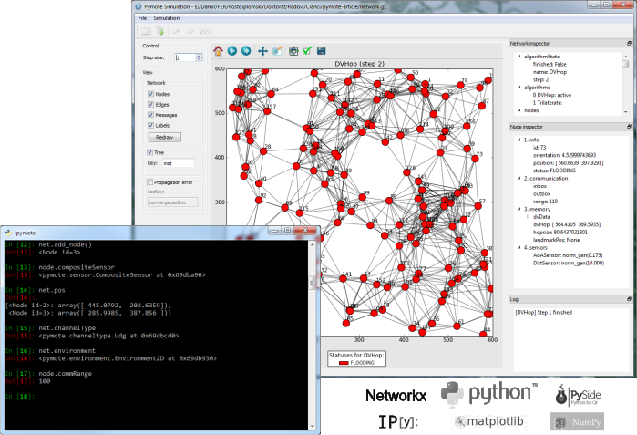

Starting Pymote3
===============
Pymote3 features interactive console based on IPython and simulation GUI.

   
   Pymote3 console and GUI
   
Interactive console (IPython)
-----------------------------
To use Pymote3 from the interactive console (IPython) start provided program 
``ipymote3`` with previously activated virtual environment::
    
    > ipymote3

.. note::

    If virtualenv is used make sure that virtual environment is activated (:ref:`linux <linux-venvact>`, :ref:`windows <windows-venvact>`) and if WinPython is used then run ``ipymote3`` from WinPython Command Prompt.

Pymote3 can also be started by starting IPython directly and using dedicated ``pymote3`` profile::

    > ipython --profile=pymote3

.. note::

    Pymote3 profile files should be present inside 
    ``pymote3_env/.ipython/profile_pymote3/ipython_config.py``
    or ``~/.ipython/profile_pymote3/ipython_config.py`` file created during Pymote3 installation.

Simulation GUI
--------------
Pymote3 features simulation GUI which can be started as standalone application using 
``pymote3-simgui`` (in Windows ``pymote3-simgui.exe``). 

.. note::

    If pymote3 is installed in virtual environment then `pymote3-simgui` starts inside this 
    environment. When network pickle is opened in simulator all algorithms this network is 
    referencing must be importable from virtual environment. The easy and proper way to ensure that
    the algorithms are importable is to use bootstrap algorithms package that can be found in 
    `pymote3-algorithms-bootstrap <https://github.com/darbula/pymote3-algorithms-bootstrap>`_ 
    and follow the instructions found there.
    

Simulation GUI running from the interactive console
^^^^^^^^^^^^^^^^^^^^^^^^^^^^^^^^^^^^^^^^^^^^^^^^^^^
Very convenient way of starting and working with the GUI is from the interactive console by running ``simulationgui.py`` like this::

    In [1]: %run path/to/pymote3/gui/simulationgui.py

The gui event loop is separated from the console. Simulation window can be accessed by using ``simgui`` and network in the simulator window by using ``simgui.net`` so all simulation objects (network, nodes, messages...) are fully inspectable and usable via console.

